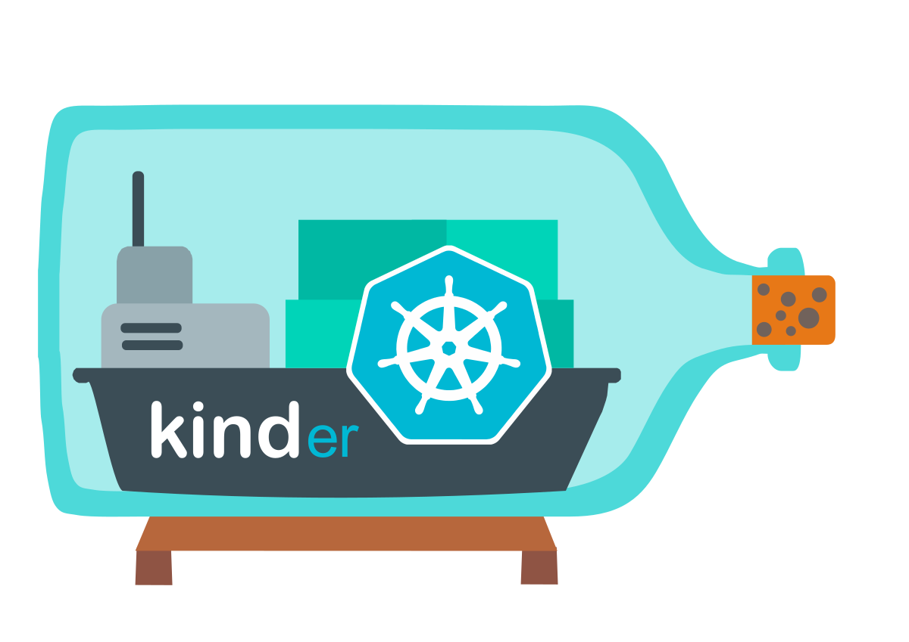

<p align="center"></p>

# kinder — kind, but with everything you actually need.

[](https://kinder.patrykgolabek.dev)
[](https://go.dev)
[](LICENSE)

kinder is a batteries-included tool for running local Kubernetes clusters using Docker container "nodes". Built on top of [kind], it pre-installs production-ready addons so you can go from zero to a fully functional cluster in one command.

## What you get

| Addon | What it does |
|-------|-------------|
| [MetalLB](https://kinder.patrykgolabek.dev/addons/metallb/) | LoadBalancer services with real external IPs from your Docker/Podman subnet |
| [Envoy Gateway](https://kinder.patrykgolabek.dev/addons/envoy-gateway/) | Gateway API routing with the `eg` GatewayClass pre-configured |
| [Metrics Server](https://kinder.patrykgolabek.dev/addons/metrics-server/) | Enables `kubectl top` and Horizontal Pod Autoscaler support |
| [CoreDNS Tuning](https://kinder.patrykgolabek.dev/addons/coredns/) | Autopath, verified pod records, and doubled cache TTL |
| [Headlamp](https://kinder.patrykgolabek.dev/addons/headlamp/) | Web-based cluster dashboard accessible via port-forward |
| [Local Registry](https://kinder.patrykgolabek.dev/addons/local-registry/) | Pre-configured `localhost:5001` registry for local image development |
| [cert-manager](https://kinder.patrykgolabek.dev/addons/cert-manager/) | TLS certificate management with a self-signed ClusterIssuer ready to use |
| [NVIDIA GPU](https://kinder.patrykgolabek.dev/addons/nvidia-gpu/) | GPU passthrough for AI/ML workloads on Linux hosts with NVIDIA drivers (opt-in) |

## Quick start

### Prerequisites

- [Go] 1.24+ &nbsp;|&nbsp; [Docker], [Podman], or [nerdctl] &nbsp;|&nbsp; [kubectl](https://kubernetes.io/docs/tasks/tools/)

### Install

**Homebrew (macOS):**

```sh
brew install patrykquantumnomad/kinder/kinder
```

**Pre-built binary:** Download from [GitHub Releases](https://github.com/PatrykQuantumNomad/kinder/releases/latest) for macOS, Linux, or Windows.

**Build from source:**

```sh
git clone https://github.com/PatrykQuantumNomad/kinder.git
cd kinder
make install
```

### Create a cluster

```sh
kinder create cluster
```

That's it. All addons are installed automatically.

### Verify

```sh
kubectl get nodes                          # node is Ready
kubectl get pods -n metallb-system         # MetalLB running
kubectl get pods -n envoy-gateway-system   # Envoy Gateway running
kubectl top nodes                          # Metrics Server working
```

### Use addon profiles

```sh
kinder create cluster --profile minimal   # no addons (core kind only)
kinder create cluster --profile gateway   # MetalLB + Envoy Gateway only
kinder create cluster --profile ci        # Metrics Server + cert-manager
```

### Diagnostic tools

```sh
kinder doctor                             # check prerequisites
kinder env                                # cluster environment info
kinder get clusters --output json         # JSON output for scripting
```

### Open the dashboard

```sh
kubectl port-forward -n kube-system service/headlamp 8080:80
```

Open [http://localhost:8080](http://localhost:8080) and paste the token printed during cluster creation.

### Delete the cluster

```sh
kinder delete cluster
```

## Configuration

kinder uses the same `kind.x-k8s.io/v1alpha4` config format as kind. Existing kind config files work without modification.

To disable specific addons:

```yaml
apiVersion: kind.x-k8s.io/v1alpha4
kind: Cluster
addons:
  dashboard: false
  envoyGateway: false
```

See the full [Configuration Reference](https://kinder.patrykgolabek.dev/configuration/).

## Why kinder over plain kind?

- **One command** — no post-install scripts to wire up MetalLB, ingress, metrics, or a dashboard
- **8 addons** — MetalLB, Envoy Gateway, Metrics Server, CoreDNS tuning, Headlamp, local registry, cert-manager, and NVIDIA GPU support
- **LoadBalancer support** — `type: LoadBalancer` works out of the box
- **Gateway API** — Envoy Gateway ready without manual CRD installation
- **Observability** — `kubectl top` and a web dashboard from the start
- **Addon profiles** — `--profile minimal|full|gateway|ci` for targeted presets
- **JSON output** — `--output json` on all read commands for scripting
- **100% compatible** — any kind config or workflow still works

## Documentation

Full docs at **[kinder.patrykgolabek.dev](https://kinder.patrykgolabek.dev)**

## Development

### Prerequisites

- [Go] 1.24+ (see `.go-version` for the exact compiler version used in CI)
- [Docker], [Podman], or [nerdctl] (for integration tests and running clusters)
- [kubectl](https://kubernetes.io/docs/tasks/tools/) (for verifying clusters)

### Makefile targets

#### Building

| Target | Description |
|--------|-------------|
| `make` | Default target — alias for `make build`. |
| `make build` | Compile the `kinder` binary to `./bin/kinder`. Uses `-trimpath` for reproducible builds, `-w` to strip debugger data for smaller binaries, and bakes the git commit into `kinder version` via `-ldflags`. |
| `make install` | Build and copy the binary to your PATH. Defaults to `$(go env GOPATH)/bin`. Override with `make install INSTALL_DIR=/usr/local/bin`. |

#### Testing

| Target | Description |
|--------|-------------|
| `make unit` | Run unit tests only. Hermetic — no Docker/Podman required. |
| `make integration` | Run integration tests only. Requires a container runtime (Docker, Podman, or nerdctl). |
| `make test` | Run all tests (unit + integration). |

#### Linting & verification

| Target | Description |
|--------|-------------|
| `make verify` | Run all verification checks — linters, generated code freshness, formatting, and shellcheck. Use this in CI. |
| `make lint` | Run Go code linters only. |
| `make shellcheck` | Run [shellcheck](https://www.shellcheck.net/) on all shell scripts. |

#### Code generation & formatting

| Target | Description |
|--------|-------------|
| `make update` | Run all auto-update scripts — regenerate code and fix formatting. |
| `make generate` | Regenerate generated code only (e.g., `zz_generated.deepcopy.go` files). |
| `make gofmt` | Run `gofmt` to fix Go source formatting. |

#### Cleanup

| Target | Description |
|--------|-------------|
| `make clean` | Delete the `./bin/` output directory and all compiled binaries. |

#### Overridable variables

| Variable | Default | Purpose |
|----------|---------|---------|
| `INSTALL_DIR` | `$(go env GOPATH)/bin` | Where `make install` copies the binary. |
| `KIND_BINARY_NAME` | `kinder` | Name of the output binary. |
| `COMMIT` | current git HEAD | Git commit hash baked into `kinder version`. |
| `CGO_ENABLED` | `0` | Disabled by default for static binaries. |

### Run locally

```sh
# build and create a cluster
make build
./bin/kinder create cluster --name dev

# verify
kubectl get nodes
kubectl get pods -A

# clean up
./bin/kinder delete cluster --name dev
```

## Contributing

Issues and pull requests are welcome at [github.com/PatrykQuantumNomad/kinder](https://github.com/PatrykQuantumNomad/kinder).

## Acknowledgements

kinder is a fork of [kind] by the Kubernetes SIG-Testing community. All credit for the core cluster lifecycle, node images, and kubeadm bootstrapping goes to the original [kind maintainers](https://kind.sigs.k8s.io/).

## License

Apache 2.0 — see [LICENSE](LICENSE) for details.

---

<p align="center">
  Built by <a href="https://patrykgolabek.dev">Patryk Golabek</a>
</p>

<!--links-->
[kind]: https://kind.sigs.k8s.io/
[Go]: https://go.dev/
[Docker]: https://www.docker.com/
[Podman]: https://podman.io/
[nerdctl]: https://github.com/containerd/nerdctl
